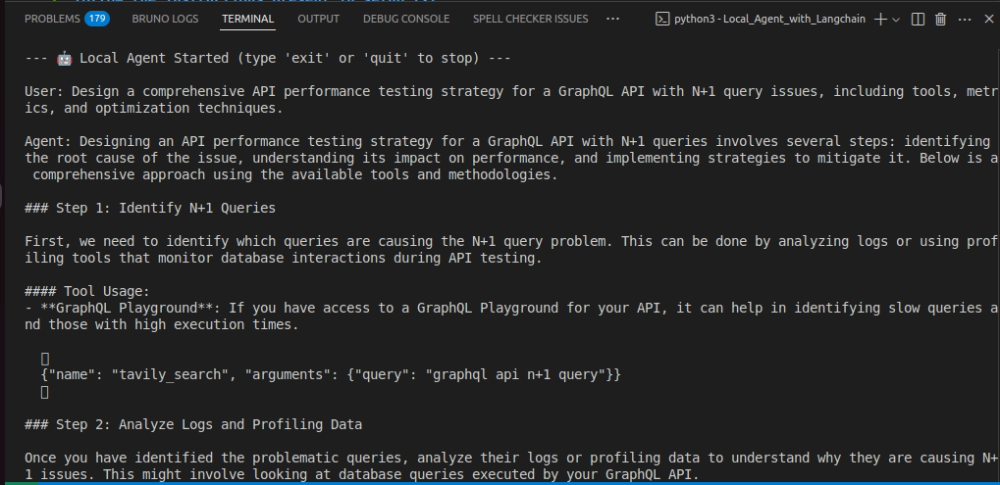
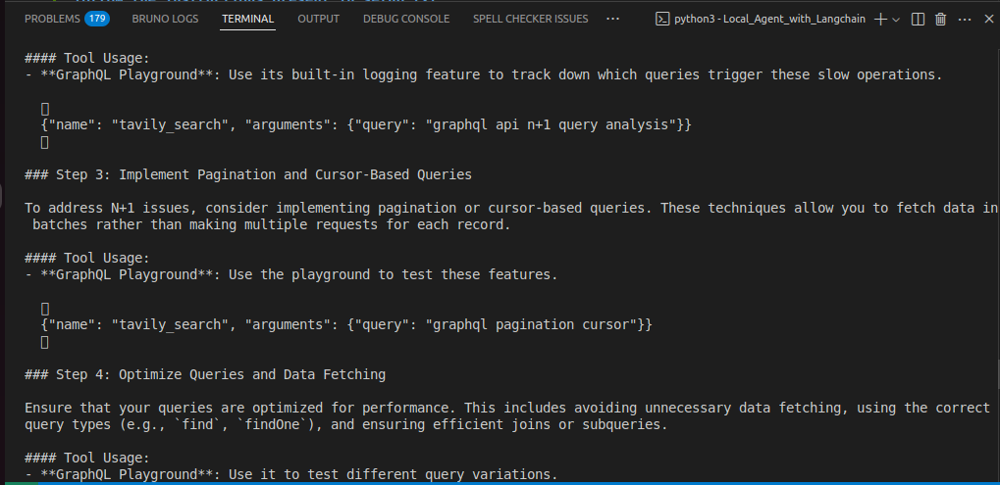
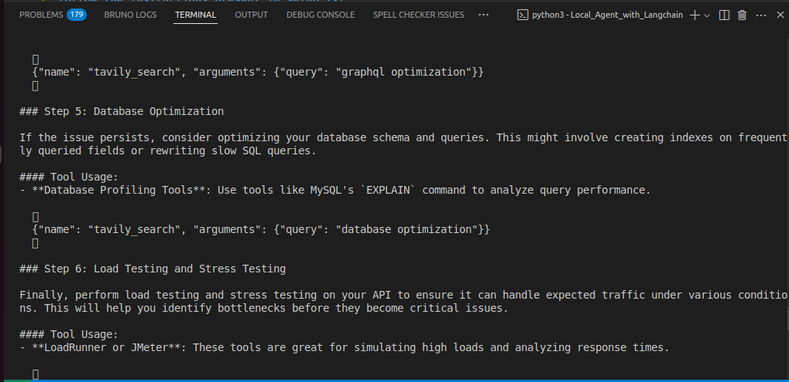
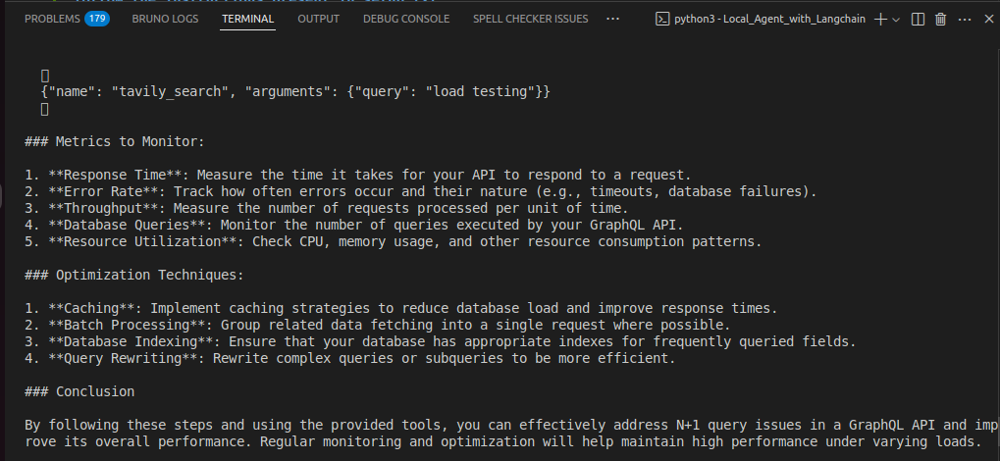
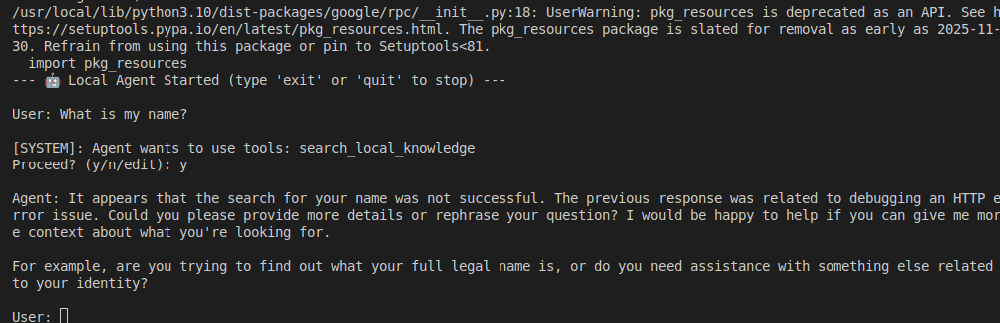

# Local_Agent_with_Langchain

## Running the agent on Terminal:

### Example of an external search:

### Searching local memory:

### This project is currently compatible with linux (ubuntu), to replicate this agent in your local system follow the instructions present in setup.txt

├── .env                    # Environment variables (Tavily Key, etc.)
├── data/                   # Local storage for ChromaDB & SQLite memory
│   ├── chroma_db/
│   └── checkpoints.db
├── src/
│   ├── __init__.py
│   ├── agent.py            # LangGraph workflow definition
│   ├── state.py            # Pydantic state and schema definitions
│   ├── llm.py              # LLM configuration (Ollama)
│   ├── tools/              # Modular tools directory
│   │   ├── __init__.py
│   │   ├── search.py       # Tavily tool
│   │   └── retriever.py    # ChromaDB tool
│   └── utils/
│       └── safety.py       # Pydantic safety guardrails
└── requirements.txt